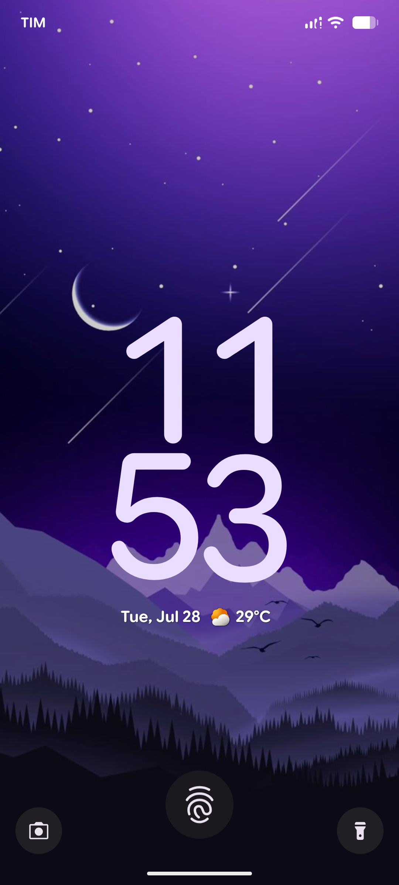
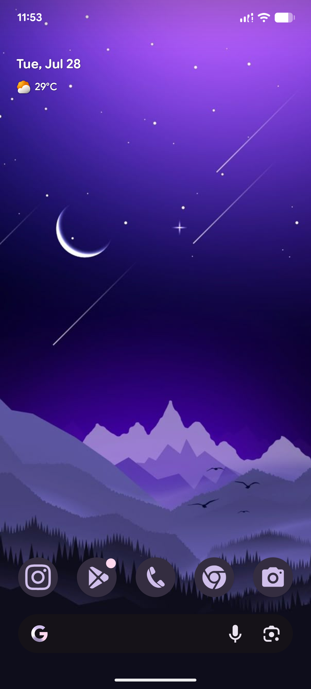
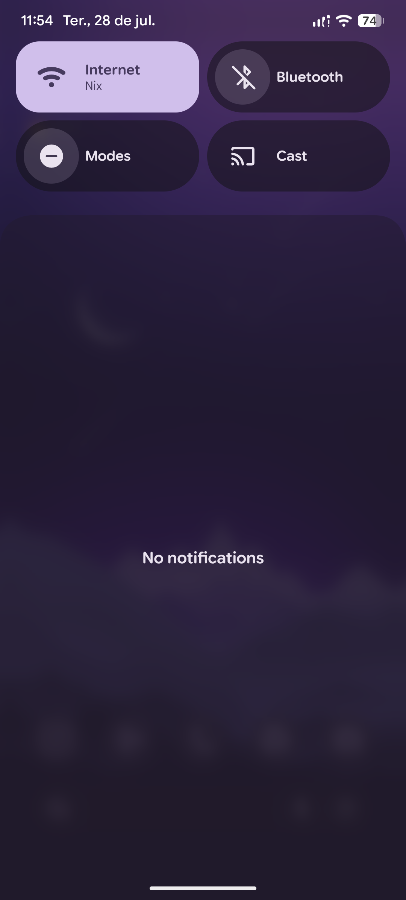
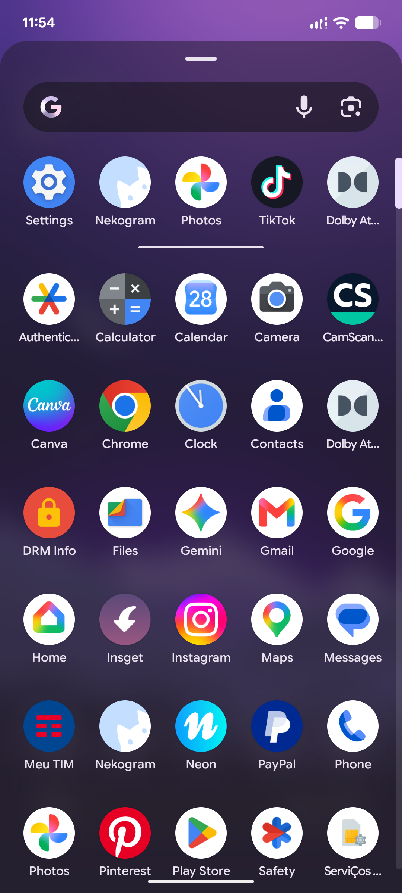
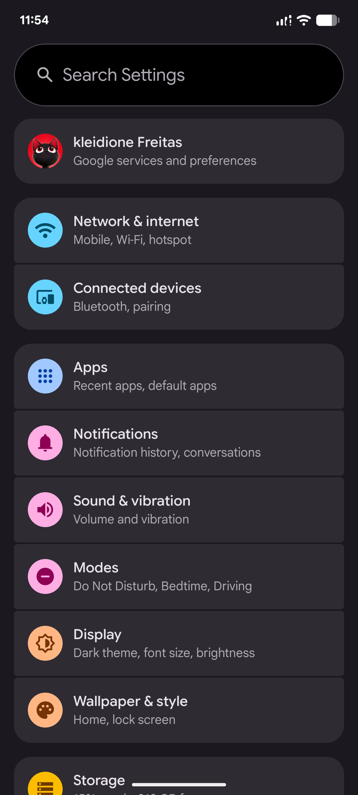
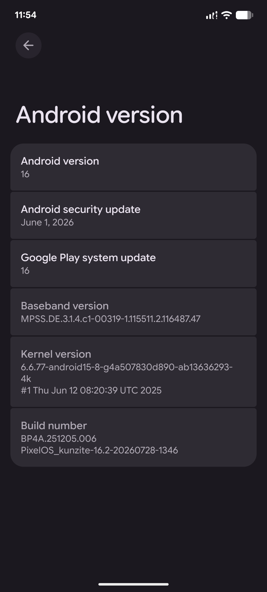
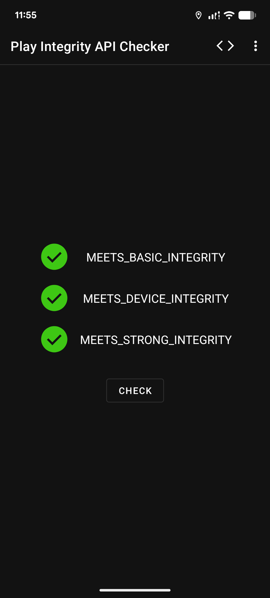
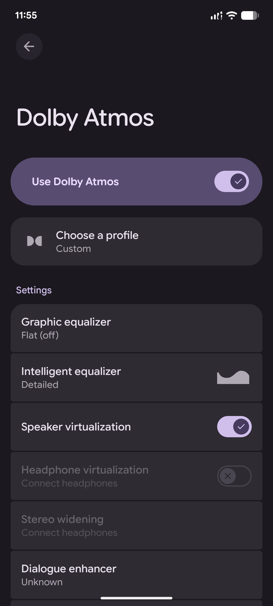
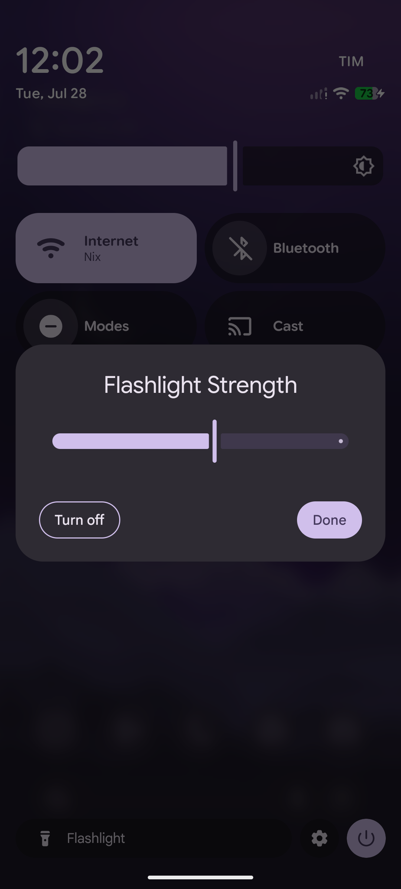

# PixelOS for Redmi Note 15 5G (kunzite)

PixelOS is an AOSP-based custom ROM with Google Pixel extras, designed to provide a clean, smooth, and feature-rich stock Android experience.

---

## 📱 Device Specifications

| Feature | Details |
| :--- | :--- |
| **Device** | Redmi Note 15 5G |
| **Codename** | `kunzite` |
| **Maintainer** | [@kleidione](https://github.com/kleidione) |
| **Android Version** | 16 (Baklava) |


---

## 📥 Downloads

| File | Link |
| :--- | :--- |
| **PixelOS ROM & Recovery** | [Download from SourceForge](https://sourceforge.net/projects/kunzite-files/files/pixelos/) |

---

---

## 🖼️ Screenshots

<p align="center">
  
  
  
</p>

<p align="center">
  
  
  
</p>

<p align="center">
  
  
  
</p>

---

## ⚡ What's Working

- [x] Boot
- [x] Wi-Fi & Bluetooth
- [x] RIL (Calls, SMS, Mobile Data)
- [x] Camera & Camcorder
- [x] Audio / Media Playback
- [x] Fingerprint / Face Unlock
- [x] Sensors & GPS
- [x] VoLTE / VoWiFi

---

## 🛠️ Installation Guide

> ⚠️ **Warning:** Perform a full backup before proceeding. Factory Reset will wipe all internal storage.

1. **Prerequisites:**
   - Unlocked Bootloader.

2. **Flashing Recovery via Fastboot:**
   - Boot your phone into **Fastboot Mode** (`Volume Down + Power`).
   - Connect your device to the PC via USB and flash the recovery image:
     ```bash
     fastboot flash recovery recovery.img
     ```

3. **Flashing Steps:**
   - Boot into Recovery mode (`Volume Up + Power`).
   - Go to **Factory Reset** > **Format data / factory reset** and confirm.
   - Return to the main menu and select **Apply update** > **Apply from ADB**.
   - Connect your device to your PC via USB and run:
     ```bash
     adb sideload /path/to/PixelOS_kunzite.zip
     ```
   - Reboot system and enjoy PixelOS!

---

## 📄 License & Credits

- **PixelOS Team** for the base ROM.
